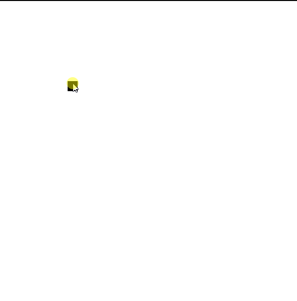

# PathFinder

PathFinder in a Maze Implemented Using the A* Algorithm and SFML For Graphics.

## Running

- After running the Program you can Press on a cell to make it 'blocked'.
- Press Enter to Solve the maze.
- Press Escape to Clear the Maze.

## Example

Here is an Example of The Program

